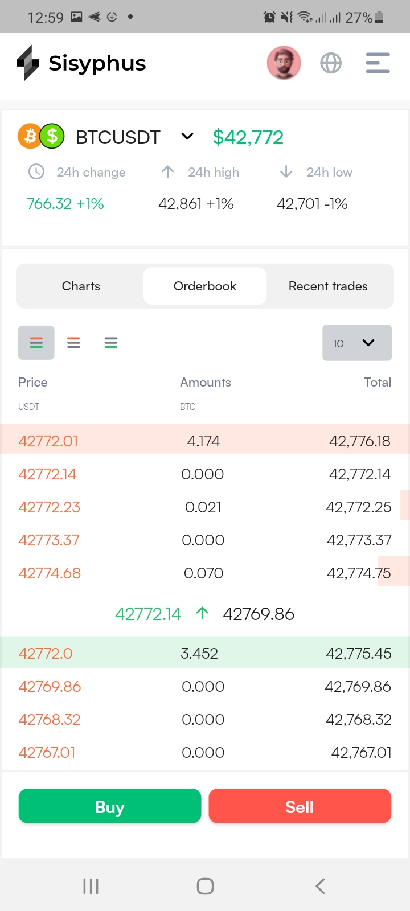
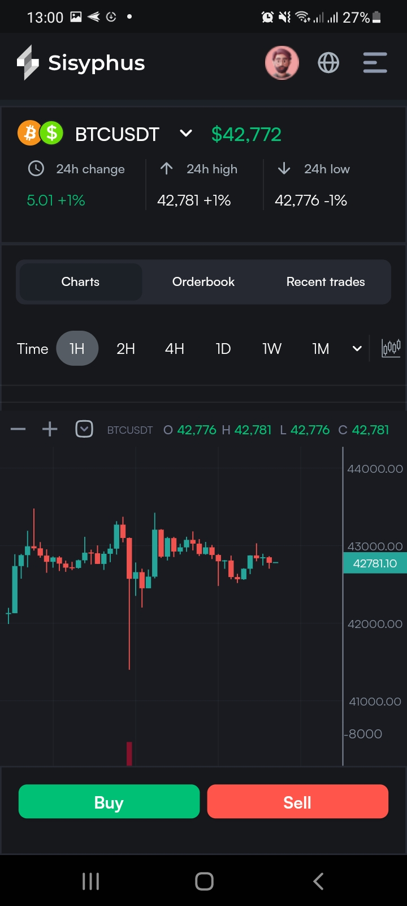
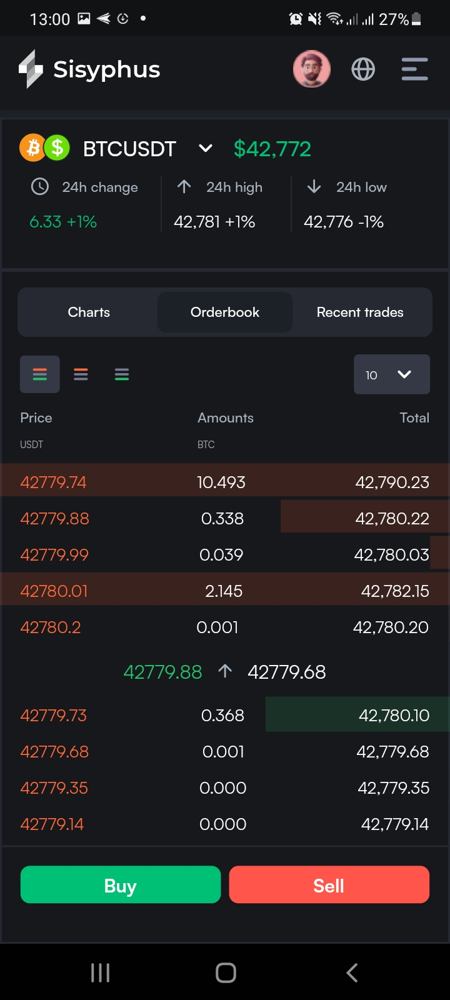

# Binance Demo

A mobile application built with FLutter framework, that leverages the Binance WebSocket API to retrieve and present real-time updates in the format of candlestick charts, mirroring the functionality found on the Binance platform.

## Dependencies

The following packages are used as dependencies in this project:
- **candlesticks:** ^2.1.0   ` A Flutter library for rendering candlestick charts`
- **flutter_svg:** ^2.0.9    `A Flutter library for parsing and rendering SVG (Scalable Vector Graphics) files`
- **dio:** ^5.4.0    `A powerful and flexible HTTP client for Flutter, Dio simplifies network requests and provides features such as interceptors, cancellation tokens, and FormData support.` 
- **flutter_riverpod:** ^2.4.9 `A provider package for Flutter applications that helps manage and propagate state through the widget tree`
- **freezed_annotation:** ^2.4.1 `A code generation package for immutable classes in Dart.`
- **web_socket_channel:** ^2.4.0   `A Flutter package for handling WebSockets`
- **intl:** ^0.19.0 `A Flutter Plugin that helps format dates, numbers, and strings according to different locales`
- **flutter:v3.13.9**   `mobile sdk`

## Dev Dependencies

These are the development-specific dependencies:

- **build_runner:** ^2.4.7 `A tool provided by the Dart team to generate code during the build process`
- **freezed:** ^2.4.5  ` a code generation package for Dart and Flutter that simplifies the process of creating immutable classes`

## Screenshots

